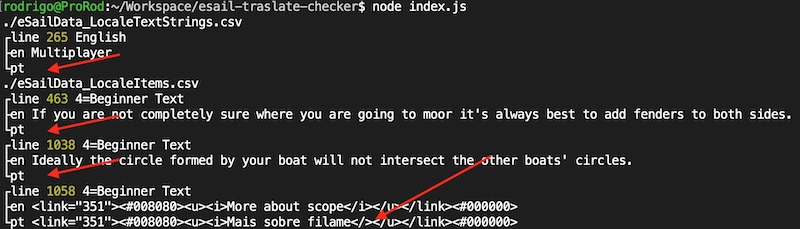

# eSail Language Translation Checker

Translate a lot of texts tempered with markup is an error prune task. This script is intended to assure the tags and structure are not compromised.

# How to Use

* NodeJS required version > 14

* Install dependecies:

    npm install

* Download csv from zoho and move than to this directory.

* Run

    node index.js
    node index.js --pt #for pt lang only

## Dev

To run the tests:

    npm run test

## Sample output




## How to Interpret the Results

Two validations is run against the CSVs.

1. Check for Empties

```
./eSailData_LocaleAlerts.csv
┌line 93 2=Alert Header
├en Apparent Wind
└it <empty>
```

*Read:* At sheet LocaleAlerts, line 93, the english column "2=Alert Header" has no corresponding italian (it) translation.

2. Markup Matcher

```
./eSailData_LocaleAlerts.csv
┌line 33 3=Alert Text     \n\n    °  <flink=000></fLink>
├en [ '<i>', '</I>', '<Rebind_Autopilot>' ]
└it [ '<i>', '<Rebind_Autopilot>' ]
```

*Read:* At sheet LocaleAlerts, line 33, the english column "3=Alert Text     \n\n    °  <flink=000></fLink> " has a problem with the markups in the corresponding italian (it) column. In the example, the problem is: "no closing </I>".

## Links

[eSail Sailing Simulator](https://www.esailyachtsimulator.com/)
